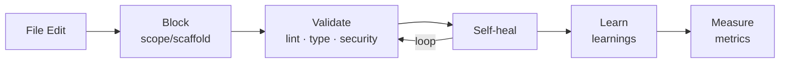

<div align="center">

# agent-harness-starter

[](https://www.npmjs.com/package/agent-harness-starter)

A harness system that automatically controls AI coding agents

**Hooks** enforce · **Rules** guide · **Learnings** adapt · **Metrics** measure

[한국어](README.ko.md)

</div>

---

## What is this?

When AI coding agents (Claude Code, Gemini CLI, etc.) write code, this harness system **automatically validates, learns from errors, and measures performance**.

- **Hook-based enforcement** — Runs type-check + lint + blockchain security checks instantly when agents modify files
- **Instant learning** — Records rules to `learnings.json` on error, injects them in the next session
- **Self-healing tracking** — Tracks whether agents detect and fix their own errors
- **3 agents supported** — Same hook scripts work across all agents



---

## Quick Start

### New project

```bash
npx agent-harness-starter@latest
```

### Add harness to existing project

```bash
npx agent-harness-starter@latest init
```

Auto-scans your project to detect languages/frameworks/linters and generates hooks + rules + skills for your chosen agent.

```
$ npx agent-harness-starter@latest init

  languages:  typescript, python, go
  stacks:     nextjs-app, python-fastapi, go-fiber
  package:    pnpm
  linters:    eslint, ruff
  test:       vitest
  arch:       clean
```

### Check metrics

```bash
npx agent-harness-starter@latest metrics
```

---

## Scaffolder (`create`, default)

Running without arguments launches the scaffolder with an interactive prompt.

```
1. Project name
2. AI agent (Claude Code / Gemini CLI / Codex CLI)
3. Issue tracker (Jira / None)
4. Repo structure (Monorepo Turborepo / Polyrepo)
5. Stack selection (Category → Stack, multiple for monorepo)
6. Stack-specific options (architecture, linter, test, etc.)
7. Docker / Graphify / Install dependencies (Y/N)
```

---

## Supported Stacks

### Frontend (8)

Next.js App Router · Next.js Pages Router · React (Vite) · Vue (Vite) · Nuxt · SvelteKit · Angular · Remix

### Backend (8)

Go (Gin) · Go (Fiber) · Java (Spring Boot) · Python (FastAPI) · Python (Django) · Node (Express) · Node (NestJS) · Rust (Axum)

### Blockchain (4)

Solidity (Hardhat) · Solidity (Foundry) · Solana (Anchor) · Move (Sui)

### Project Detection (`init`)

| Target | Method |
|--------|--------|
| Languages | package.json, go.mod, Cargo.toml, pyproject.toml, pom.xml, Move.toml, foundry.toml |
| Frameworks | Matching deps (next/fiber/fastapi, etc.) |
| Linters | eslint, biome, golangci-lint, ruff |
| Package managers | Lock file based (npm/pnpm/yarn/bun) + go/cargo/pip/poetry/maven/gradle/forge/sui |
| Architecture | src/ directory structure (FSD/Clean/Modular) |
| Monorepo | pnpm-workspace.yaml, npm workspaces → scans all sub-packages |

---

## Supported Agents

3 agents supported. Hook scripts are identical — only the config file format differs per agent.

### Agent Hook Configuration

| Agent | Hooks | Config file | Pre/Post mapping |
|-------|:-----:|-------------|-----------------|
| Claude Code | O | `.claude/settings.json` | PreToolUse / PostToolUse |
| Gemini CLI | O | `.gemini/settings.json` | BeforeTool / AfterTool |
| Codex CLI | O | `.codex/hooks.json` | PreToolUse / PostToolUse |

> **Works best with Claude Code.** PostToolUse's `additionalContext` is automatically injected into the agent context, enabling self-heal auto-fix and AutoHarness rule additions within the agent loop. Other agents support hook execution + metrics collection, but auto-fix instruction delivery varies.

### Multi-agent

Multiple agents can be used simultaneously on a single project.

```bash
npx agent-harness-starter@latest init  # First: Claude
npx agent-harness-starter@latest init  # Second: Gemini
# → harness.config.json adapters: ["claude", "gemini"]
```

- `harness.config.json` — shared (single source of truth)
- `.harness/` (metrics, learnings) — shared
- hooks/settings — independent per agent (`.claude/hooks/`, `.gemini/hooks/`)

---

## SDLC Workflow

Two tracks available.

### Issue-based (Jira + Figma)

```
/start <issue-id> → Issue lookup → Figma analysis → Implementation plan → Code
/done              → Quality gate → Commit → MR creation
```

`/start` performs everything from issue lookup to implementation plan:

1. **Issue lookup** (`/fetch-issue`) — Fetch title/description/type via Jira API
2. **Ticket validation** — Check required fields (acceptance criteria, Figma links, etc.)
3. **Figma analysis** (`/figma`) — Read wireframes + design via MCP
4. **Branch creation** (`/branch`) — Auto prefix based on issue type (`feature/`, `fix/`, etc.)
5. **Change analysis** — Codebase search + complexity assessment
6. **Implementation plan** — Present step-by-step plan (proceed after user confirmation)

### From scratch (without Jira/Figma)

```
/plan → /analyze → /design → /generate → Code → /done
```

### `/done` Quality Gates

| Gate | Skill | Validation |
|------|-------|-----------|
| 1 | `/lint` | lint + type-check |
| 2 | `/test` | Test execution (3x self-heal loop on failure) |
| 3 | — | Verify tests exist for policy keyword changes |
| 4 | — | Check for unintended file changes |
| 5 | — | Exclude unnecessary files (.env, etc.) |

All 5 gates pass → `/commit` → `/create-mr` → Auto MR creation

### Individual Skills

Each pipeline step can be used independently.

| Skill | Role |
|-------|------|
| `/fetch-issue <id>` | Jira issue lookup |
| `/branch <id>` | Issue-based branch creation |
| `/figma <URL>` | Figma design analysis (built-in token-saving strategy) |
| `/lint` | lint + type-check |
| `/test` | Test + 3x self-heal loop |
| `/commit` | Staged-based commit (auto-extracts issue ID from branch) |
| `/create-mr` | push + MR creation |
| `/code-review` | Code review |
| `/metrics` | Harness metrics |

### External Service Integration

Configure in `.env` at project root (see `.env.example`).

| Service | Environment Variables | Purpose |
|---------|----------------------|---------|
| Jira Cloud | `JIRA_BASE_URL`, `JIRA_USER_EMAIL`, `JIRA_API_TOKEN` | `/start` issue lookup + status change |
| GitLab | `GITLAB_URL`, `GITLAB_TOKEN` | `/done` MR creation |
| GitLab project | `GITLAB_PROJECT_ID` (optional) | Auto-detected from git remote, fallback |
| Figma | MCP integration | `/start` wireframe/design analysis |

---

## Hook System

All agents use the same hook scripts. Only the config file format differs per agent.

### Hooks

| Hook | Timing | Action |
|------|--------|--------|
| **scope-guard** | Before file edit | Block edits outside allowed scopes |
| **scaffold-guard** | Before file creation | File naming validation |
| **post-write** | After file edit | lint + type-check + blockchain security + instant learning |
| **session-init** | Session start | Inject project context + metrics summary |
| **stop-review** | Session end | Build + test + scope verification |

### Blockchain Security Checks (post-write)

| File | Checks |
|------|--------|
| `.sol` | tx.origin (SWC-115), selfdestruct (SWC-106), delegatecall (SWC-112), floating pragma (SWC-103), reentrancy |
| `.rs` (Anchor) | unchecked arithmetic, unwrap() in production |
| `.move` | public entry without assert! |

### Self-heal Auto-fix

When post-write detects errors, behavior varies by error type.

| Error type | Action | Examples |
|-----------|--------|----------|
| Simple errors | Auto-fix immediately (no confirmation) | TS2322 type mismatch, lint errors |
| Security errors | Explain cause + present fix plan + confirm before fix | SWC-115, Reentrancy, delegatecall |

### AutoHarness Auto-learning

When the same error repeats 3+ times, a rule is automatically added to `harness.config.json`'s `codingStandards`.

```
🔧 [AutoHarness] TS2322 repeated 4 times → "strict-return-type" auto-added
```

---

## Metrics

Measures harness effectiveness.

### How to check

**Auto-summary at session start:**

```
📊 Blocked: 12 | first-pass: 65% | errors: 28 (last 7 days)
```

**Detailed via CLI:**

```bash
npx agent-harness-starter@latest metrics
```

```
📊 Harness Metrics (last 7 days)
─────────────────────────
scope-guard blocked:    12
scaffold-guard blocked:  3
post-write errors:      28
self-heal success:      22/28 (79%)
first-pass success:     18/28 (64%)

🔥 Most common errors:
  TS2322 (type mismatch): 9
  TS7006 (implicit any):  5
```

### Metric Definitions

| Metric | Description |
|--------|-------------|
| **Block rate** | Number of blocks by scope-guard/scaffold-guard |
| **first-pass** | Ratio of files passing first post-write without errors |
| **self-heal** | Ratio of error files subsequently modified to clean |

---

## Generated Structure

```
my-project/
├── harness.config.json          # Harness config (single source of truth)
├── .env.example                 # Environment variable template (Jira, GitLab, etc.)
├── .claude/                     # When Claude Code is selected
│   ├── settings.json            #   Hook registration
│   ├── hooks/                   #   Hook scripts
│   ├── rules/                   #   Rule files
│   └── skills/                  #   Skills (workflow, metrics, etc.)
├── .gemini/                     # When Gemini CLI is selected
│   ├── settings.json
│   ├── hooks/
│   └── rules/
├── .harness/                    # Runtime state (gitignored)
│   ├── metrics.jsonl            #   Metric event log
│   ├── learnings.json           #   Auto-learned rules
│   └── errors.log               #   Error log
├── docs/features/               # SDLC artifacts
│   └── <feature>/
│       ├── plan.json            #   /plan output
│       ├── spec.md              #   /analyze output
│       └── design.md            #   /design output
└── GEMINI.md                    # Gemini rule file (root)
```

---

## Development

```bash
npm install
npm run build
node dist/cli.js              # New project
node dist/cli.js init         # Existing project
node dist/cli.js metrics      # Check metrics

# Tests
npx vitest run
```

---

## Publishing

```bash
npm version patch && npm run publish:github   # 0.1.3 → 0.1.4 (bug fix)
npm version minor && npm run publish:github   # 0.1.4 → 0.2.0 (feature)
npm version major && npm run publish:github   # 0.2.0 → 1.0.0 (breaking change)
```

---

## References

### Agent Hooks Documentation

| Agent | Documentation |
|-------|--------------|
| Claude Code | [Hooks Guide](https://docs.anthropic.com/en/docs/claude-code/hooks) |
| Gemini CLI | [Hooks Reference](https://geminicli.com/docs/hooks/reference/) |
| Codex CLI | [Hooks](https://developers.openai.com/codex/hooks) |

### Blockchain Security Rule Sources

| Stack | Source |
|-------|--------|
| Solidity | [SWC Registry](https://swcregistry.io/) |
| Solana | [Sealevel Attacks](https://github.com/coral-xyz/sealevel-attacks) |
| Move | [Hacken Audit Checklist](https://hacken.io/discover/move-smart-contract-audit-checklist/) |

### Agent Rule References

| Source | Description |
|--------|-------------|
| [awesome-cursorrules](https://github.com/PatrickJS/awesome-cursorrules) | Community agent rules collection |
| [block/ai-rules](https://github.com/block/ai-rules) | Block (Square) agent rules |
| [Trellis](https://github.com/mindfold-ai/Trellis) | Multi-agent workflow framework |
| [Agent Skills Standard](https://agentskills.io) | SKILL.md open standard |

### Framework/Language Documentation

| Stack | Docs |
|-------|------|
| React | [react.dev](https://react.dev/) |
| Next.js | [nextjs.org/docs](https://nextjs.org/docs) |
| Go | [go.dev/doc](https://go.dev/doc/) |
| Rust | [doc.rust-lang.org](https://doc.rust-lang.org/book/) |
| Python | [docs.python.org](https://docs.python.org/3/) |
| Anchor | [anchor-lang.com](https://www.anchor-lang.com/) |
| Move | [move-language.github.io](https://move-language.github.io/move/) |
