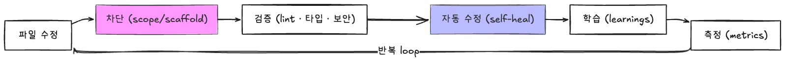
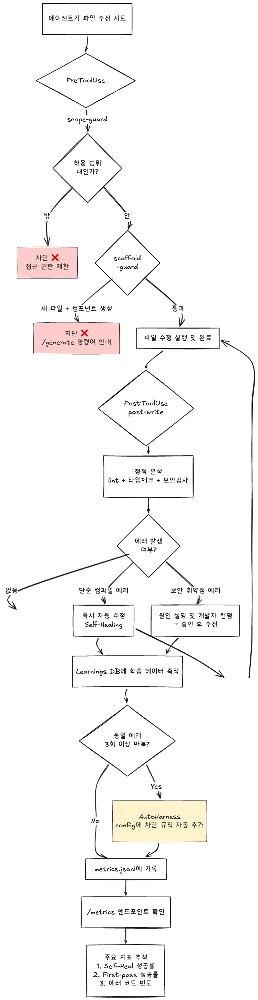

<div align="center">

# agent-harness-starter

AI 코딩 에이전트를 자동으로 제어하는 하네스 시스템

**Hooks**로 강제 · **Rules**로 안내 · **Learnings**로 학습 · **Metrics**로 측정

</div>

---

## What is this?

AI 코딩 에이전트(Claude Code, Gemini CLI, Cursor 등)가 코드를 작성할 때 **자동으로 검증하고, 에러에서 학습하고, 성과를 측정**하는 하네스 시스템입니다.

- **Hook 기반 자동 강제** — 에이전트가 파일을 수정하면 즉시 타입체크 + lint(설정 시) + 블록체인 보안검사(.sol/.rs/.move) 실행
- **에러 즉시 학습** — 에러 발생 시 `learnings.json`에 규칙 자동 기록, 다음 세션에 주입
- **Self-healing 추적** — 에이전트가 에러를 감지하고 수정했는지 자동 추적
- **8개 에이전트 지원** — 같은 hook 스크립트가 모든 에이전트에서 동작

<!-- 하네스 플로우 다이어그램 — 아래 이미지를 교체하세요 -->
<p align="center">
  
</p>

---

## 시작하기

### 환경변수 설정 (최초 1회)

토큰값은 [Passbolt](https://passbolt.dtechlab.com/)에 등록되어 있습니다.

**macOS / Linux:**

```bash
echo 'export GITLAB_FP_NPM_DEPLOY_TOKEN=토큰값' >> ~/.zshrc
source ~/.zshrc
```

**Windows (PowerShell):**

```powershell
[System.Environment]::SetEnvironmentVariable('GITLAB_FP_NPM_DEPLOY_TOKEN', '토큰값', 'User')
```

### npm registry 설정 (최초 1회)

```bash
echo -e '@frontend-playground:registry=https://gitlab.dtechlab.com/api/v4/projects/128/packages/npm/\n//gitlab.dtechlab.com/api/v4/projects/128/packages/npm/:_authToken=${GITLAB_FP_NPM_DEPLOY_TOKEN}' >> ~/.npmrc
```

---

## Quick Start

### 새 프로젝트

```bash
npx @frontend-playground/agent-harness-starter@latest
```

### 기존 프로젝트에 하네스 추가

```bash
npx @frontend-playground/agent-harness-starter@latest init
```

프로젝트를 자동 스캔하여 언어/프레임워크/린터를 감지하고, 선택한 에이전트에 맞는 hooks + rules + skills를 생성합니다.

```
$ npx @frontend-playground/agent-harness-starter@latest init

  languages:  typescript, python, go
  stacks:     nextjs-app, python-fastapi, go-fiber
  package:    pnpm
  linters:    eslint, ruff
  test:       vitest
  arch:       clean
```

### 메트릭 확인

```bash
npx @frontend-playground/agent-harness-starter@latest metrics
```

---

## 스캐폴더 (`create`, default)

인자 없이 실행하면 기본으로 스캐폴더가 실행됩니다. 인터랙티브 프롬프트로 옵션을 선택합니다.

```
1. 프로젝트 이름
2. AI 에이전트 (Claude / Cursor / Windsurf / Cline / Copilot / Aider / Gemini / Codex)
3. 이슈 트래커 (Jira / None)
4. 레포 구조 (모노레포 Turborepo / 폴리레포)
5. 스택 선택 (카테고리 → 스택, 모노레포면 복수 선택)
6. 스택별 세부 옵션 (아키텍처, 린터, 테스트 등)
7. Docker / Graphify / 의존성 설치 (Y/N)
```

---

## 지원 스택

### Frontend (8)

Next.js App Router · Next.js Pages Router · React (Vite) · Vue (Vite) · Nuxt · SvelteKit · Angular · Remix

### Backend (8)

Go (Gin) · Go (Fiber) · Java (Spring Boot) · Python (FastAPI) · Python (Django) · Node (Express) · Node (NestJS) · Rust (Axum)

### Blockchain (4)

Solidity (Hardhat) · Solidity (Foundry) · Solana (Anchor) · Move (Sui)

### 프로젝트 감지 (`init`)

| 감지 대상     | 방법                                                                               |
| ------------- | ---------------------------------------------------------------------------------- |
| 언어 (복수)   | package.json, go.mod, Cargo.toml, pyproject.toml, pom.xml, Move.toml, foundry.toml |
| 프레임워크    | deps에서 next/fiber/fastapi 등 매칭                                                |
| 린터 (복수)   | eslint, biome, golangci-lint, ruff                                                 |
| 패키지 매니저 | lock 파일 기반 (npm/pnpm/yarn/bun) + go/cargo/pip/poetry/maven/gradle/forge/sui    |
| 아키텍처      | src/ 디렉토리 구조 (FSD/Clean/Modular)                                             |
| 모노레포      | pnpm-workspace.yaml, npm workspaces → 하위 패키지 전체 스캔                        |

---

## 지원 에이전트

8개 에이전트를 지원합니다. hook 스크립트는 동일하고, 환경변수 폴백으로 자동 호환됩니다.

### 에이전트별 Hook 설정

| 에이전트       | Hooks | 설정 파일                    | Pre/Post 매핑            |
| -------------- | :---: | ---------------------------- | ------------------------ |
| Claude Code    |   O   | `.claude/settings.json`      | PreToolUse / PostToolUse |
| Gemini CLI     |   O   | `.gemini/settings.json`      | BeforeTool / AfterTool   |
| Cursor         |   O   | `.cursor/hooks.json`         | onPreEdit / onPostEdit   |
| Windsurf       |   O   | `.windsurf/hooks.json`       | pre-action / post-action |
| Cline          |   O   | `.clinerules/hooks.json`     | PreToolUse / PostToolUse |
| GitHub Copilot |   O   | `.github/hooks/harness.json` | preToolUse / postToolUse |
| Codex CLI      |  \*   | `.codex/hooks.json`          | PreToolUse / PostToolUse |
| Aider          |   -   | `.aider.conf.yml`            | lint-cmd only            |

\* Codex CLI: `apply_patch` hook 지원 (최신 버전 필요)

> **Claude Code에서 가장 완전하게 동작합니다.** PostToolUse의 `additionalContext`를 에이전트 컨텍스트에 자동 주입하여 self-heal 자동 수정, AutoHarness 규칙 추가가 에이전트 루프 안에서 자동으로 처리됩니다. 다른 에이전트는 hook 실행 + 메트릭 수집은 되지만 자동 수정 지시 전달 방식이 에이전트마다 다릅니다.

### 멀티 에이전트

한 프로젝트에서 여러 에이전트를 동시에 사용할 수 있습니다.

```bash
npx @frontend-playground/agent-harness-starter@latest init  # 첫 번째: Claude
npx @frontend-playground/agent-harness-starter@latest init  # 두 번째: Gemini
# → harness.config.json의 adapters: ["claude", "gemini"]
```

- `harness.config.json` — 공유 (single source of truth)
- `.harness/` (metrics, learnings) — 공유
- hooks/settings — 에이전트별 독립 (`.claude/hooks/`, `.gemini/hooks/`)

---

## Hook System

모든 에이전트가 동일한 hook 스크립트를 사용합니다. 설정 파일 포맷만 에이전트별로 다릅니다.

### Hooks

| Hook                   | 시점         | 동작                                        |
| ---------------------- | ------------ | ------------------------------------------- |
| **scope-guard**        | 파일 수정 전 | 허용 범위 밖 파일 수정 차단                 |
| **scaffold-guard**     | 파일 생성 전 | `/generate` 사용 안내                       |
| **post-write**         | 파일 수정 후 | lint + 타입체크 + 블록체인 보안 + 즉시 학습 |
| **session-init**       | 세션 시작    | 프로젝트 컨텍스트 + 메트릭 요약 주입        |
| **stop-review**        | 세션 종료    | 빌드 + 테스트 + 스코프 검증                 |
| **learnings-recorder** | 세션 종료    | errors.log → learnings.json 변환            |

### 블록체인 보안 검사 (post-write)

| 파일           | 검사 항목                                                                                                  |
| -------------- | ---------------------------------------------------------------------------------------------------------- |
| `.sol`         | tx.origin (SWC-115), selfdestruct (SWC-106), delegatecall (SWC-112), floating pragma (SWC-103), reentrancy |
| `.rs` (Anchor) | unchecked arithmetic, unwrap() in production                                                               |
| `.move`        | public entry without assert!                                                                               |

### 상세 플로우

<!-- 상세 플로우 다이어그램 — 아래 이미지를 교체하세요 -->
<p align="center">
  
</p>

### Self-heal 자동 수정

post-write hook이 에러를 감지하면 에러 종류에 따라 동작이 다릅니다.

| 에러 종류 | 동작                                 | 예시                              |
| --------- | ------------------------------------ | --------------------------------- |
| 단순 에러 | 즉시 자동 수정 (컨펌 없음)           | TS2322 타입 불일치, lint 에러     |
| 보안 에러 | 원인 설명 + 수정 계획 + 컨펌 후 수정 | SWC-115, Reentrancy, delegatecall |

### AutoHarness 자동 학습

같은 에러가 3회 이상 반복되면 `harness.config.json`의 `codingStandards`에 규칙을 자동 추가합니다.

```
🔧 [AutoHarness] TS2322 4회 반복 → "strict-return-type" 자동 추가됨
```

매핑 예시:
| 에러 코드 | 자동 추가 규칙 |
|----------|--------------|
| TS2322 | `strict-return-type` — 함수 반환 타입을 반드시 명시한다 |
| TS7006 | `no-implicit-any` — 파라미터에 타입을 반드시 명시한다 |
| SWC-115 | `no-tx-origin` — tx.origin 대신 msg.sender를 사용한다 |
| SWC-103 | `fixed-pragma` — Solidity pragma 버전을 고정한다 |

---

## Metrics

하네스의 효과를 측정합니다.

### 확인 방법

**세션 시작 시 자동 요약:**

```
📊 차단: 12회 | first-pass: 65% | 에러감지: 28회 (최근 7일)
```

**CLI로 상세 확인:**

```bash
npx @frontend-playground/agent-harness-starter@latest metrics
```

```
📊 Harness Metrics (최근 7일)
─────────────────────────
scope-guard 차단:    12회
scaffold-guard 차단:  3회
post-write 에러 감지: 28회
self-heal 성공:      22/28 (79%)
first-pass 성공:     18/28 (64%)

🔥 가장 많은 에러:
  TS2322 (타입 불일치): 9회
  TS7006 (암시적 any):  5회
```

### 메트릭 정의

| 메트릭         | 설명                                                    |
| -------------- | ------------------------------------------------------- |
| **차단율**     | scope-guard/scaffold-guard가 차단한 횟수                |
| **first-pass** | 파일의 첫 post-write 이벤트가 에러 없이 통과한 비율     |
| **self-heal**  | 에러 감지 후 같은 파일이 수정되어 clean으로 전환된 비율 |

---

## 생성되는 구조

```
my-project/
├── harness.config.json          # 하네스 설정 (single source of truth)
├── .claude/                     # Claude Code 선택 시
│   ├── settings.json            #   hook 등록
│   ├── hooks/                   #   hook 스크립트 7개
│   ├── rules/                   #   룰 파일
│   └── skills/                  #   스킬 (code-review, metrics 등)
├── .gemini/                     # Gemini CLI 선택 시
│   ├── settings.json
│   ├── hooks/
│   └── rules/
├── .harness/                    # 런타임 상태 (gitignore)
│   ├── metrics.jsonl            #   메트릭 이벤트 로그
│   ├── learnings.json           #   자동 학습 규칙
│   └── errors.log               #   에러 로그
└── GEMINI.md                    # Gemini 룰 파일 (루트, 에이전트 규약)
```

---

## 개발

```bash
npm install
npm run build
node dist/cli.js              # 새 프로젝트
node dist/cli.js init         # 기존 프로젝트
node dist/cli.js metrics      # 메트릭 확인

# 테스트 (132개)
npx vitest run
```

---

## 배포

`GITLAB_FP_PROJECT_TOKEN` 환경변수가 필요합니다. 토큰값은 [Passbolt](https://passbolt.dtechlab.com/)에 등록되어 있습니다.

**macOS / Linux:**

```bash
echo 'export GITLAB_FP_PROJECT_TOKEN=토큰값' >> ~/.zshrc
source ~/.zshrc
```

**Windows (PowerShell):**

```powershell
[System.Environment]::SetEnvironmentVariable('GITLAB_FP_PROJECT_TOKEN', '토큰값', 'User')
```

```bash
npm version patch && npm run publish:gitlab   # 0.1.3 → 0.1.4 (버그 수정)
npm version minor && npm run publish:gitlab   # 0.1.4 → 0.2.0 (기능 추가)
npm version major && npm run publish:gitlab   # 0.2.0 → 1.0.0 (Breaking Change)
```

---

## 참고 자료

### 에이전트 Hooks 문서

| 에이전트       | 문서                                                                |
| -------------- | ------------------------------------------------------------------- |
| Claude Code    | [Hooks Guide](https://docs.anthropic.com/en/docs/claude-code/hooks) |
| Gemini CLI     | [Hooks Reference](https://geminicli.com/docs/hooks/reference/)      |
| Codex CLI      | [Hooks](https://developers.openai.com/codex/hooks)                  |
| Cursor         | [Hooks](https://cursor.com/docs/hooks)                              |
| Cline          | [Hooks](https://docs.cline.bot/customization/hooks)                 |
| GitHub Copilot | [Hooks](https://docs.github.com/en/copilot/concepts/agents/hooks)   |

### 블록체인 보안 룰 출처

| 스택     | 출처                                                                                      |
| -------- | ----------------------------------------------------------------------------------------- |
| Solidity | [SWC Registry](https://swcregistry.io/)                                                   |
| Solana   | [Sealevel Attacks](https://github.com/coral-xyz/sealevel-attacks)                         |
| Move     | [Hacken Audit Checklist](https://hacken.io/discover/move-smart-contract-audit-checklist/) |

### 에이전트 룰 참고

| 출처                                                                    | 설명                                |
| ----------------------------------------------------------------------- | ----------------------------------- |
| [awesome-cursorrules](https://github.com/PatrickJS/awesome-cursorrules) | 커뮤니티 에이전트 룰 모음           |
| [block/ai-rules](https://github.com/block/ai-rules)                     | Block(Square) 에이전트 룰           |
| [Trellis](https://github.com/mindfold-ai/Trellis)                       | 멀티 에이전트 워크플로우 프레임워크 |
| [Agent Skills Standard](https://agentskills.io)                         | SKILL.md 오픈 스탠다드              |

### 프레임워크/언어 공식 문서

| 스택    | 문서                                                             |
| ------- | ---------------------------------------------------------------- |
| React   | [react.dev](https://react.dev/)                                  |
| Next.js | [nextjs.org/docs](https://nextjs.org/docs)                       |
| Go      | [go.dev/doc](https://go.dev/doc/)                                |
| Rust    | [doc.rust-lang.org](https://doc.rust-lang.org/book/)             |
| Python  | [docs.python.org](https://docs.python.org/3/)                    |
| Anchor  | [anchor-lang.com](https://www.anchor-lang.com/)                  |
| Move    | [move-language.github.io](https://move-language.github.io/move/) |
